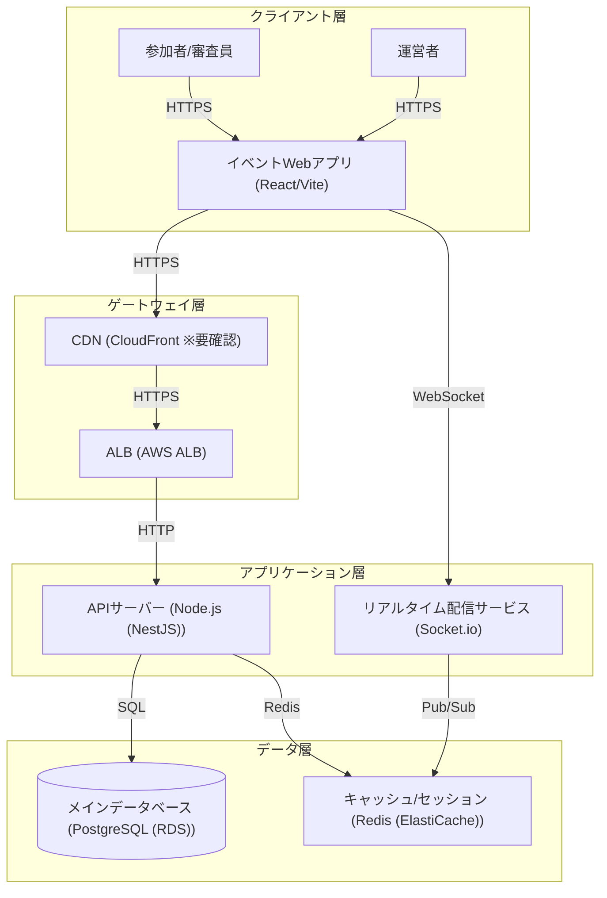

# アーキテクチャ構成図

> バージョン: 1 | 更新日時: 2026/6/24 15:38:56

リアルタイムQ&Aおよび投票機能を備えたイベントプラットフォームのシステム構成

**クライアント層:**
- 参加者/審査員
- 運営者
- イベントWebアプリ [React/Vite]

**ゲートウェイ層:**
- CDN [CloudFront ※要確認]
- ALB [AWS ALB]

**アプリケーション層:**
- APIサーバー [Node.js (NestJS)]
- リアルタイム配信サービス [Socket.io]

**データ層:**
- メインデータベース [PostgreSQL (RDS)]
- キャッシュ/セッション [Redis (ElastiCache)]

**接続:**
- 参加者/審査員 → イベントWebアプリ (HTTPS)
- 運営者 → イベントWebアプリ (HTTPS)
- イベントWebアプリ → CDN (HTTPS)
- CDN → ALB (HTTPS)
- ALB → APIサーバー (HTTP)
- イベントWebアプリ → リアルタイム配信サービス (WebSocket)
- APIサーバー → メインデータベース (SQL)
- APIサーバー → キャッシュ/セッション (Redis)
- リアルタイム配信サービス → キャッシュ/セッション (Pub/Sub)

