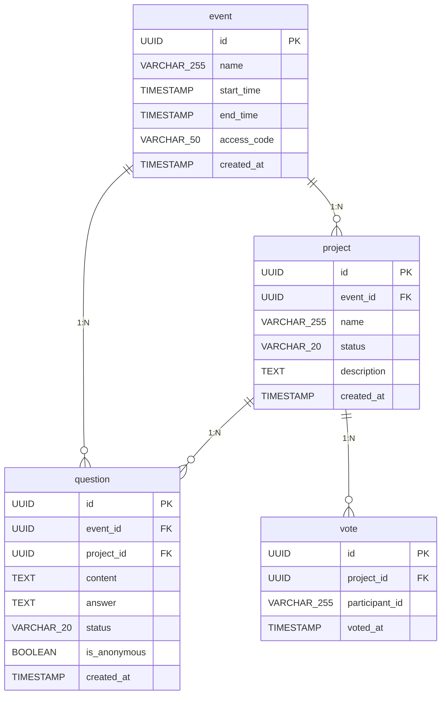

# ER図

> バージョン: 2 | 更新日時: 2026/6/24 15:44:07

ピッチングイベントにおけるイベント、プロジェクト、質問、投票のER図。質問への回答機能と、プロジェクトごとの質問管理を反映。

### エンティティ一覧

**EVENT**

| カラム名 | データ型 | キー |
| --- | --- | --- |
| id | UUID | PK |
| name | VARCHAR(255) |  |
| start_time | TIMESTAMP |  |
| end_time | TIMESTAMP |  |
| access_code | VARCHAR(50) |  |
| created_at | TIMESTAMP |  |

**PROJECT**

| カラム名 | データ型 | キー |
| --- | --- | --- |
| id | UUID | PK |
| event_id | UUID | FK |
| name | VARCHAR(255) |  |
| status | VARCHAR(20) |  |
| description | TEXT |  |
| created_at | TIMESTAMP |  |

**QUESTION**

| カラム名 | データ型 | キー |
| --- | --- | --- |
| id | UUID | PK |
| event_id | UUID | FK |
| project_id | UUID | FK |
| content | TEXT |  |
| answer | TEXT |  |
| status | VARCHAR(20) |  |
| is_anonymous | BOOLEAN |  |
| created_at | TIMESTAMP |  |

**VOTE**

| カラム名 | データ型 | キー |
| --- | --- | --- |
| id | UUID | PK |
| project_id | UUID | FK |
| participant_id | VARCHAR(255) |  |
| voted_at | TIMESTAMP |  |

### リレーション

- EVENT → PROJECT (1:N)
- EVENT → QUESTION (1:N)
- PROJECT → QUESTION (1:N)
- PROJECT → VOTE (1:N)

### ER図

