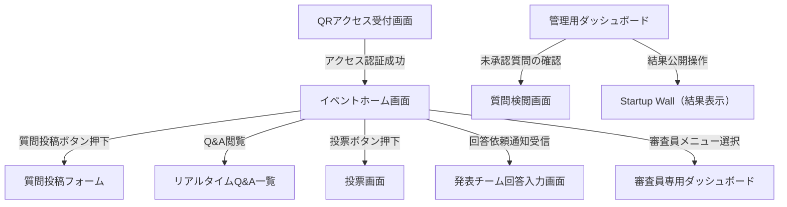

# 画面遷移

> バージョン: 2 | 更新日時: 2026/6/24 15:44:11

イベント参加者用（QRアクセス）、運営管理用（管理ダッシュボード）、発表チーム回答用、および審査員向けダッシュボードの画面遷移図。各ユーザー役割に基づいた導線を定義し、Q&Aフローと投票機能を中心に構成。

**フロー:**
- QRアクセス受付画面 → イベントホーム画面 (アクセス認証成功)
- イベントホーム画面 → 質問投稿フォーム (質問投稿ボタン押下)
- イベントホーム画面 → リアルタイムQ&A一覧 (Q&A閲覧)
- イベントホーム画面 → 投票画面 (投票ボタン押下)
- イベントホーム画面 → 発表チーム回答入力画面 (回答依頼通知受信)
- 管理用ダッシュボード → 質問検閲画面 (未承認質問の確認)
- 管理用ダッシュボード → Startup Wall（結果表示） (結果公開操作)
- イベントホーム画面 → 審査員専用ダッシュボード (審査員メニュー選択)

